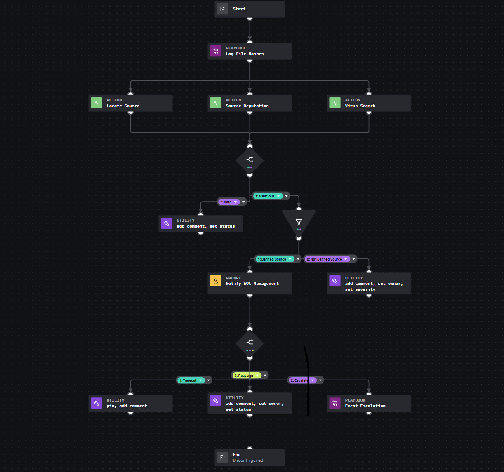
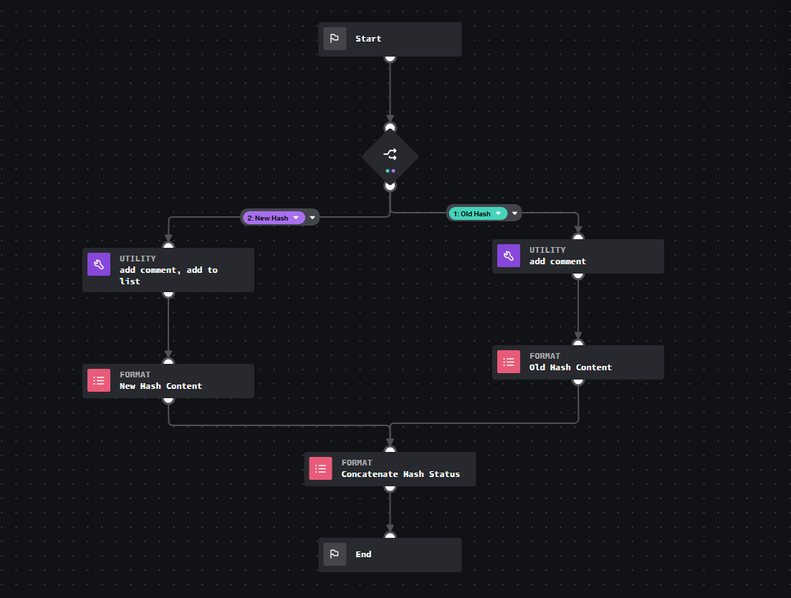
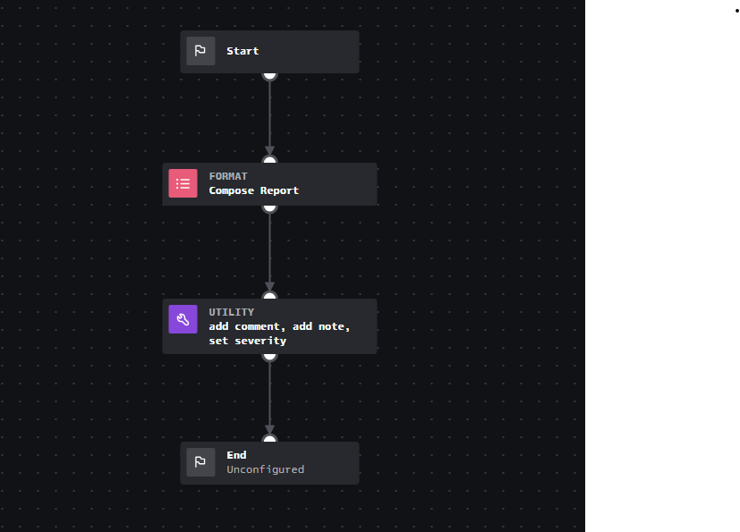

# soar-playbooks
Splunk SOAR playbooks - made for portfolio purposes and proof of concept/work - not intended for PROD environments.

## Investigation Lab
Investigation Lab files are for an automation playbook that has several flowchart steps in response to a HTPP File download event detection including comparing the files hash to known hashes, investigating the file itself using VirusTotal, checking the files source location and domain reputability. An additional filter checks to see if the source country is in a banned countries list. Depending on the data discovered, the playbook itself will then lower the events priority and assign it to a team for review, escalate the event for immediate review, or close it.

## Log File Hashes
Log File Hashes files are for an input playbook (child to Investigation Lab) that immediately compares the hash of the downloaded file to a list of known hashes to see if it is a known file and whether it is malicious or not before continuing through the lab automate playbook.

## Event Escalation
Event Escalation files are for an input playbook (child to Investigation Lab) that takes info in response to a call for escalation on an event at the bottom of the automation in response to a prompt to security engineers on whether it needs escalation.

